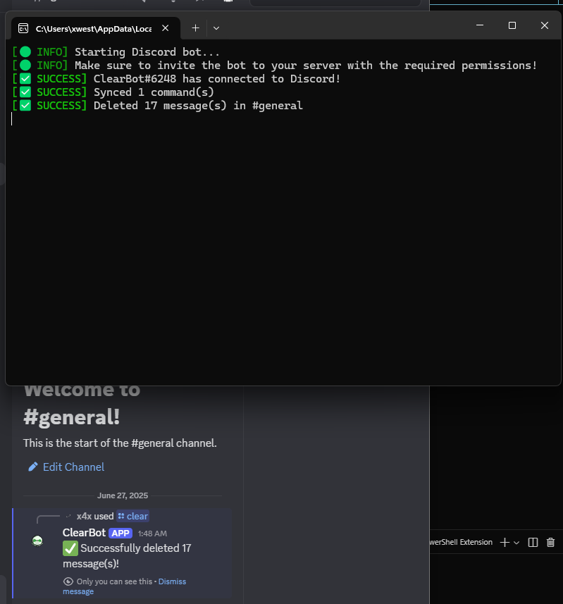

# ClearBot



A modern, stylish Discord bot for clearing messages with a single slash command. Built with Python, `discord.py`, and beautiful console output.

---

## Features

- **Slash Command:** `/clear` to delete all or a specified number of messages in a channel
- **Permission Checks:** Only users with "Manage Messages" can use the command
- **Ephemeral Responses:** Bot replies are only visible to the command user
- **Handles Discord Limits:** Skips messages older than 14 days (Discord API limitation)
- **Beautiful Console Logs:** Colorful, emoji-enhanced logs for a professional look
- **Easy Setup:** Just add your token and run

---

## Preview


---

## Getting Started

### 1. Clone the Repository
```bash
git clone https://github.com/yourusername/clearbot.git
cd clearbot
```

### 2. Install Dependencies
```bash
pip install -r requirements.txt
```

### 3. Set Up Your Bot Token
- Copy `env_example.txt` to `.env` and add your Discord bot token:
  ```env
  DISCORD_TOKEN=your_token_here
  ```

### 4. Run the Bot
```bash
python main.py
```

---

## Usage

- **/clear** — Deletes all messages in the current channel
- **/clear [amount]** — Deletes the specified number of recent messages

> **Note:** You and the bot both need the "Manage Messages" permission in the channel.

---

## Contributing

Pull requests are welcome! For major changes, please open an issue first to discuss what you would like to change.

---

## License

MIT License. See [LICENSE](LICENSE) for details.

---

## Contact

For questions or support, open an issue or contact the maintainer via GitHub. 